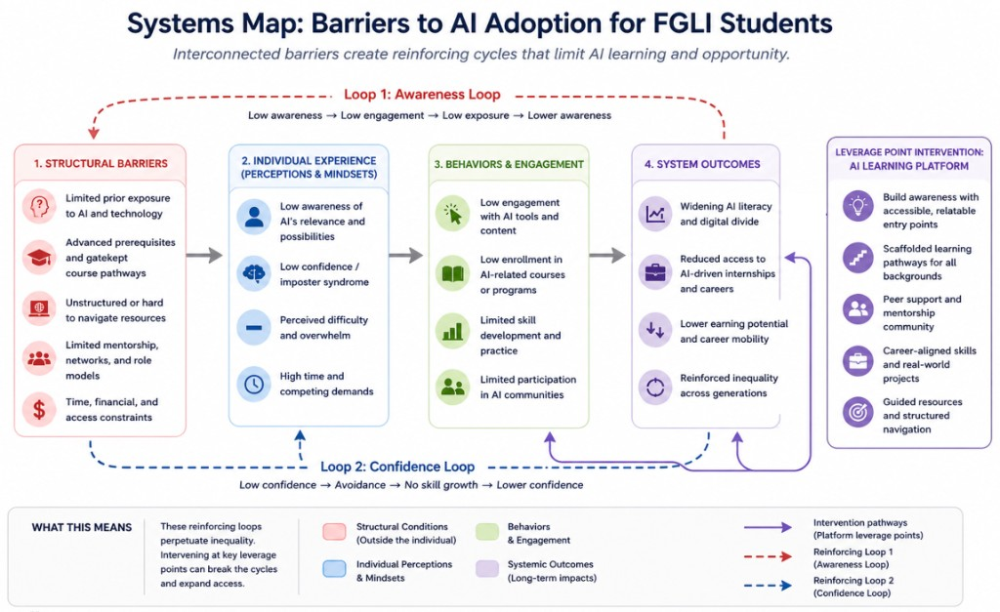

# AIPath

**Website**: https://cs276finalproject.vercel.app/

**Paper**: https://drive.google.com/file/d/1kHfQa9cCZhylNNVy1hmw1uo9e-CcsaWR/view?usp=sharing

**AIPath** is a public-facing Next.js site for **AI fluency**, designed for **first-generation and low-income (FGLI)** undergraduates. It presents a six-module, milestone-based curriculum, emphasizes **career/domain relevance**, surfaces **peer stories and projects**, and collects interest sign-ups. The implementation reflects the participatory design findings and explicit design goals described in the Harvard CS 276 companion paper *Is AI Really an Equalizer? Lowering Barriers to AI Literacy for FGLI Students* (authors: Maya Ganesh, Hyungsik Kim, Jasmine Liu, Richael Saka). A PDF draft of that work lives locally as **`ImpactCorps_Final_Paper.pdf`**.

---

## Research background (from the paper)

- **Problem:** AI is often portrayed as leveling the playing field, but **meaningful AI literacy** remains uneven. Many pathways assume **prior technical grounding** and do not foreground **structural barriers** FGLI students face (exposure, mentorship, clarity of pathways, career relevance).

- **Method:** Mixed methods including surveys and semi-structured interviews with FGLI and non-FGLI students inform **design goals** and **systems thinking** around feedback loops (**awareness** and **confidence**) that can deepen stratification unless interrupted by **accessible entry**, **scaffolding**, **peer support**, and **career-aligned work**.

### Systems map (barriers and leverage points)

The paper’s Figure 1 summarizes how structural factors connect to perceptions, behaviors, reinforcing loops (awareness and confidence), and long-run outcomes—with the proposed intervention (accessible pathways, scaffolding, peers, career-aligned projects) positioned as a **leverage point** to interrupt those cycles.



*Structural barriers lead to low awareness and confidence, limited engagement, and unequal outcomes (awareness and confidence feedback loops). An AI learning platform is shown as a leverage-point intervention with accessible entry, scaffolding, peers, and career-aligned projects.*

- **Design goals mapped in the codebase (high level)**

  | Goal | Idea | Rough site mapping |
  |------|------|---------------------|
  | DG1 — Career relevance | Students need to see AI as useful *in their field* before investing attention | Homepage **career selector**, **domain-aware links**, `DomainValueBlock` |
  | DG2 — Self-efficacy | “Could someone like me build something?” | **Peer story gallery**, **project gallery**, “no coding required” framing |
  | DG3 — Structural barriers | Cost, vague starting point, time | **`GroundedPanel`**, milestones under ~90 min, $0 framing |
  | DG4 — Structured + project-based learning | Guided milestones over passive lectures | **`/curriculum`**, six modules with lessons + activities |
  | DG5 — Identified motivation (not hype/framed urgency) | Connect to learners’ goals | Editorial tone on home/about; personalization via `/join` |

- **Interview-grounded specifics in content:** Examples include scaffolding for literature review (**Perplexity**-style workflows in Module 3 notes), emphasis on explicit vocabulary (“model,” “LLM”), and peer critique as central to growth (Modules 5–6)—aligned with quotations and themes in the participatory findings and systems-design sections of the paper.

---

## What’s in this repository

| Area | Path | Notes |
|------|------|--------|
| Paper figure (README) | `docs/assets/` | Systems map PNG used in **Research background** below |
| Pages | `app/` | Next.js App Router: home, `/about`, `/curriculum`, `/curriculum/[moduleId]`, `/stories`, `/projects`, `/join` |
| UI | `components/` | Navbar, progressive disclosure, **`CareerSelector`**, **`DomainValueBlock`**, **`GroundedPanel`**, module UI, peer board stubs, etc. |
| Curriculum data | `lib/modules.ts` | Six modules with markdown lessons, goals, activity checklists |
| Careers / domains | `lib/careers.ts` | Medicine, law, education, social science, business (+ “exploring”) |
| Stories & projects | `lib/peer-stories.ts`, `lib/projects.ts` | Illustrative, interview-grounded composites for motivation |
| Local-only progress | `lib/progress.ts` | **`localStorage`** for module completion and peer-board posts (no backend persistence for learning activity) |

Stack: **Next.js 14**, **React 18**, **TypeScript**, **Tailwind CSS**, **Framer Motion**, **react-markdown**.

---

## Local development

**Requirements:** Node.js 18+ (LTS recommended) and npm.

```bash
cd /path/to/this/repo
npm install
npm run dev
```

Then open [http://localhost:3000](http://localhost:3000). If **`EMFILE` / “too many open files”** appears on macOS during dev file watching:

```bash
WATCHPACK_POLLING=true npm run dev
```

Other scripts:

```bash
npm run build   # production build
npm run start   # serve production build
npm run lint    # ESLint
```

---

## Environment variables (`/join` → interest API)

`/app/api/interest/route.ts` posts sign-ups to **Airtable** when configured. Without these vars, submissions return **503** with a polite “not configured” message.

Create `.env.local` (never commit it; it’s gitignored):

```bash
AIRTABLE_BASE_ID=your_base_id
AIRTABLE_API_KEY=your_pat
# optional — defaults to "Interest"
AIRTABLE_TABLE_NAME=Interest
```

---

## Curriculum overview (six modules)

Defined in **`lib/modules.ts`**:

1. **What Even Is AI?** — Vocabulary (models, LLMs, misconceptions).  
2. **Finding Your Project Idea** — Framing problems in the learner’s context.  
3. **Conducting a Literature Review with AI** — Rapid scoping with verification (**Perplexity**-oriented prompts in copy).  
4. **Building Your Project** — No-code / low-code / code tracks.  
5. **Peer Review & Critique** — Structured feedback loops.  
6. **Presenting & Positioning Your Work** — Resumes, interviews, narratives.

Public UI mirrors the paper’s milestone narrative (shared vocabulary → idea → literature → prototype → critique → story).
